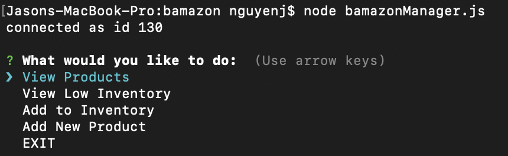
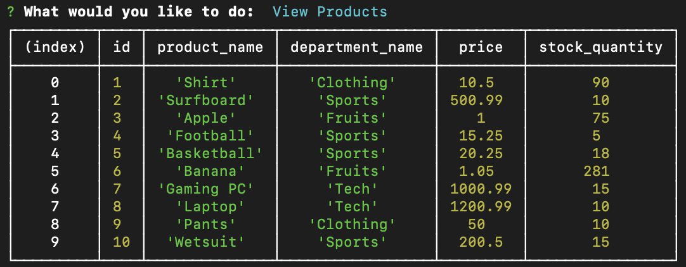
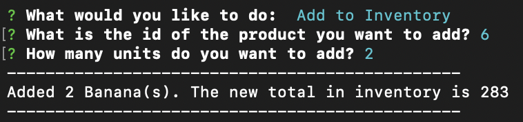
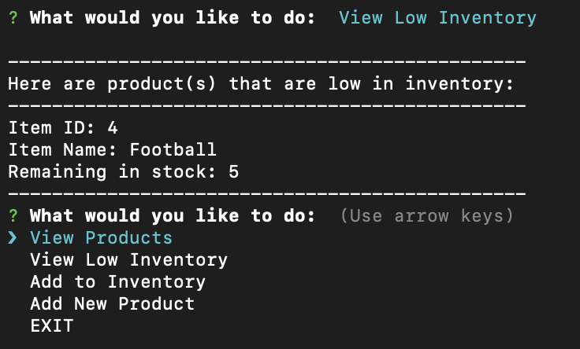
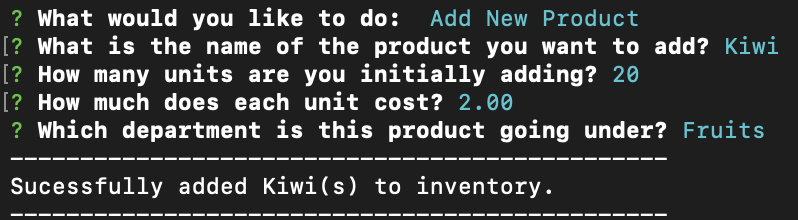
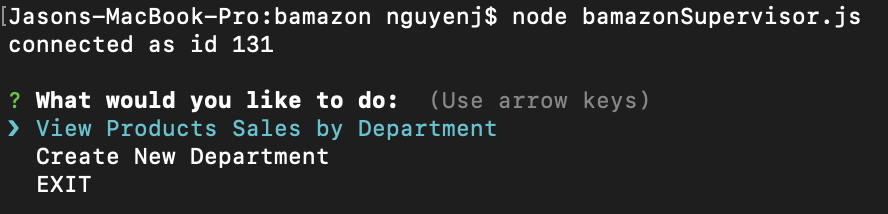
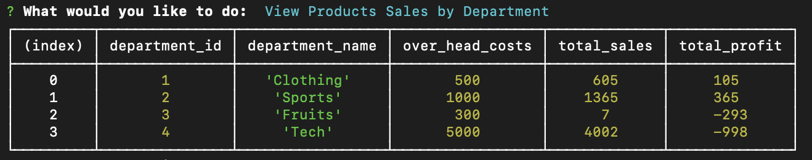
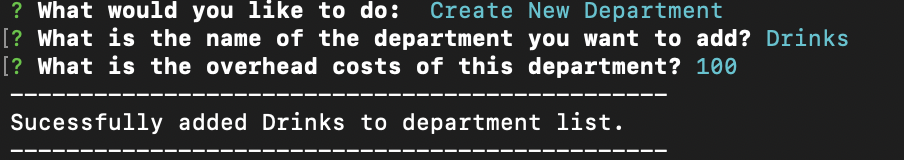

# bamazon

The bamazon app is a simplified version of Amazon in which a user can play as the consumer, manager, or supervisor of an online marketplace and manage all the day-to-day operations. The customer is able to purchase products available using unlimited fake currency as long as there is enough in stock. Managers are able to view the current inventory status, add to inventory, and add new prodcuts. Supervisors are able to view the status of the departments, total sales, over head costs, and add departments.

The application was written using mySQL, javascript, and nodeJS.

Commands currently available include: 
1) bamazonCustomer
2) bamazonManager
3) bamazonSupervisor

Requests should be formatted in the following way: 

    node "COMMAND"

    Example: node bamazonCustomer

Link to the github repo: [GitHub Repo](https://github.com/nguyenj0215/bamazon)

Screenshots: 
bamazonCustomer:

bamazonManager:

bamazonSupervisor:

